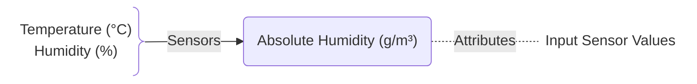
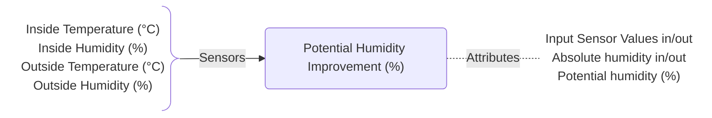
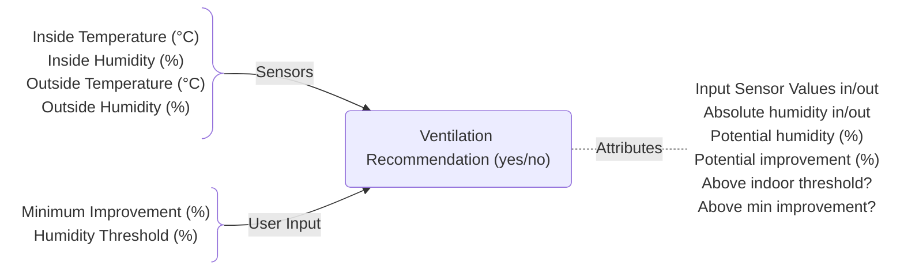

# Ventilation Recommendation

**When ventilation actually makes sense?**  
This project provides a set of **Home Assistant [template](https://www.home-assistant.io/integrations/template/#using-blueprints) blueprints** that help you decide when ventilation actually makes sense.  
- Calculate absolute humidity 💧 based on existing sensor values
- Estimate the potential humidity improvement 📈
- Get clear ventilation recommendation 🚦
- Reduce indoor humidity effectively 📉
- Avoid unnecessary heat loss ❄️
- For data-driven automations for smart and efficient airing decisions 🔀

---

## 1. Calculate the Absolute Humidity 💧

This one is the most basic sensor. It simply calculates the absolute humidity based on Temperature (°C) and relative Humidity (%). 

Can be used for statistics 📊 or as trigger for automation ⚙️. The Input values are also available as attributes:



<details><summary><strong>Setup</strong></summary>

To set up this sensor, you need to do two things:
1. Import this Blueprint  
[](https://my.home-assistant.io/redirect/blueprint_import/?blueprint_url=https%3A%2F%2Fgithub.com%2FFlo-R1der%2FMy_Smart-Home_stuff%2Fblob%2Fmain%2Fventilation-recommendation%2Fabsolute-humidity.yaml)
2. Add one ore multiple sensors to your `configuration.yaml` (or `template.yaml`):

```yaml
template:
  - use_blueprint:
      path: Flo-R1der/absolute-humidity.yaml
      input:
      temperature: #weather-station-or-forecast-or-room-temperature
      relative_humidity: #weather-station-or-forecast-or-room-humidity
    name: Absolute Humidity #outside-or-room-name
    unique_id: absolute_humidity_ #outside-or-room-name
```
Obviously you need to fill the correct entity-id for each input sensor. You can set up one sensor for each area you want to track (outside, living room, bedroom, bath, ...).


> **Note**: You can see the cocking for lunch and dinner, as well as the ventilation having an effect on both: absolute humidity and temperature. Also the absolute humidity outside is always lower then inside. This sensor makes both values comparable!

</details>

---

## 2. Calculate the Potential Humidity Improvement 📈

This sensor compares the inside and outside Temperature (°C) and relative Humidity (%) to calculate the theoretical improvement.

Can be used for statistics 📊 or as trigger for automation ⚙️. The Input values are also available as attributes:



This is done in three steps:
1. Calculates the outside absolute humidity
2. Calculates the theoretical humidity with the air from outside
3. Subtracts the calculate humidity from the measured humidity. Result = this sensor value


<details><summary><strong>Setup</strong></summary>

To set up this sensor, you need to do two things:
1. Import this Blueprint  
[](https://my.home-assistant.io/redirect/blueprint_import/?blueprint_url=https%3A%2F%2Fgithub.com%2FFlo-R1der%2FMy_Smart-Home_stuff%2Fblob%2Fmain%2Fventilation-recommendation%2Fpotential-humidity-improvement.yaml)
2. Add one ore multiple sensors to your `configuration.yaml` (or `template.yaml`):

```yaml
template:
  - use_blueprint:
      path: Flo-R1der/potential-humidity-improvement.yaml
      input:
        outside_temperature: #weather-station-or-forecast
        outside_humidity: #weather-station-or-forecast
        inside_temperature: #room-temperature
        inside_humidity: #room-humidity
    name: Potential Humidity Improvement #room-name
    unique_id: potential_humidity_improvement_ #room-name
```
Obviously you need to fill the correct entity-id for each input sensor. You can set up one sensor for each room you want to track (living room, bedroom, bath, ...).


> **NOTE**: When ventilation takes place, the potential improvement drops and rises again afterwards.

</details>

---

## 3. Ventilation Recommendation 🚦

This sensor compares the inside and outside Temperature (°C) and relative Humidity (%) to calculate the theoretical improvement and directly give an advice if ventilation is recommended or not.

Can be used as trigger for automation ⚙️ or as an traffic light system 🚦 to inform users via UI or any external lights. The Input values are also available as attributes:



<details><summary><strong>Setup</strong></summary>

To set up this sensor, you need to do two things:
1. Import this Blueprint  
[](https://my.home-assistant.io/redirect/blueprint_import/?blueprint_url=https%3A%2F%2Fgithub.com%2FFlo-R1der%2FMy_Smart-Home_stuff%2Fblob%2Fmain%2Fventilation-recommendation%2Fventilation-recommendation.yaml)
2. Add one ore multiple sensors to your `configuration.yaml` (or `template.yaml`):

```yaml
template:
  - use_blueprint:
      path: Flo-R1der/ventilation-recommendation.yaml
      input:
        outside_temperature: #weather-station-or-forecast
        outside_humidity: #weather-station-or-forecast
        inside_temperature: #room-temperature
        inside_humidity: #room-humidity
        minimum_improvement_value: 10 #change-if-required
        threshold_room_humidity: 50 #change-if-required
    name: Ventilation Recommendation #room-name
    unique_id: ventilation_recommendation_ #room-name
```
Obviously you need to fill the correct entity-id for each input sensor. Adjust the values for `minimum_improvement_value` and `threshold_room_humidity` if you like. You can set up one sensor for each room you want to track (living room, bedroom, bath, ...).


<br>

> **Tip**:  
> Instead of the fixed numbers in yaml for `minimum_improvement_value` and `threshold_room_humidity`, you can also use `input_number` helpers for more dynamic adjustment of those two input values.
> 
> ```yaml
> minimum_improvement_value: "{{ states('input_number.min_ventilation_improvement')|int }}"
> threshold_room_humidity: "{{ states('input_number.humidity_threshold')|int }}"
> ```

</details>

---

## ❤️ Like My Work?
[](https://ko-fi.com/I3I4160K4Y)  
Part [My Smart Home Stuff](https://github.com/Flo-R1der/My_Smart-Home_stuff/).
